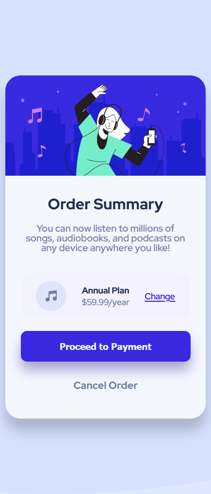

# Frontend Mentor - Order summary card solution

This is a solution to the [Order summary card challenge on Frontend Mentor](https://www.frontendmentor.io/challenges/order-summary-component-QlPmajDUj). Frontend Mentor challenges help you improve your coding skills by building realistic projects. 

## Table of contents

- [Overview](#overview)
  - [The challenge](#the-challenge)
  - [Screenshot](#screenshot)
  - [Links](#links)
- [My process](#my-process)
  - [Built with](#built-with)
  - [What I learned](#what-i-learned)
  - [Continued development](#continued-development)
  - [Useful resources](#useful-resources)
- [Author](#author)
- [Acknowledgments](#acknowledgments)

## Overview

### The challenge

Users should be able to:

- See hover states for interactive elements

### Screenshot

### Links

- Solution URL: [Add solution URL here](https://github.com/LeoSouzaNunes/order-summary-component-main)
- Live Site URL: [Add live site URL here](https://leosouzanunes.github.io/order-summary-component-main/)

## My process

### Built with

- Semantic HTML5 markup
- CSS custom properties
- Flexbox
- Mobile-first workflow

### What I learned

I was able to apply some flexbox properties solve a little problem with the overlay of the hero image using overflow: hidden to fill it inside of the card rounded border. 

### Continued development

I would like to apply SASS and React.js to my future projects.

### Useful resources

- [Example resource 1](Live Server) - This resource helped me with a overview of my project.

## Author

- Frontend Mentor - [@LeoSouzaNunes](https://www.frontendmentor.io/profile/LeoSouzaNunes)
